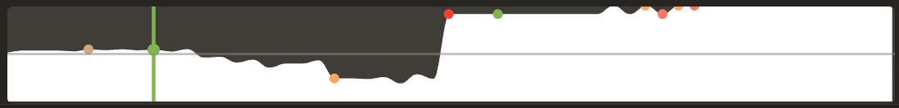

# Overview

This project demonstrates the use of imitation learning to create a chess-playing bot modeled after Hikaru Nakamura's games on Chess.com. The project is structured into four main components:

1. Data Collection
2. Data Preprocessing
3. Model Training
4. Inference

Components 1 and 2 are used to collect and preprocess the data, while components 3 and 4 are used to train the model and make predictions. The project is implemented in Python and uses the Chess.com public API for fetching the Hikaru Nakamura games data.

# Data Collection

This script fetches all games played by Hikaru Nakamura on Chess.com and stores them in a CSV file.

How it works:

 - Connects to the Chess.com API and retrieves game data.
 - Parses and cleans the data, extracting relevant information such as moves, results, and player colors.
 - Saves the cleaned data into a CSV file named hikaru_all_games.csv.

To run the script, execute the following command:
    
    ```bash
    python web_scrap_chess_com.py
    ```

# Data Preprocessing

This Jupyter Notebook processes the game data from the CSV file

How it works : 

 - Loads the CSV file containing the game data.
 - Converts the chessboard states and moves into a suitable format for training.

To run the notebook, open up the file in any Jupyter Notebook environment and execute the cells.

# Model Training

The notebook then trains a CNN model on the processed data.

How it works:

 - Defines and trains a convolutional neural network (CNN) model.
 - Saves the trained model to a file named hikaru_chess_model.h5.

To run the notebook, open up the file in any Jupyter Notebook environment and execute the cells after the data processing ones.

# Inference

This script uses the trained model to make predictions on new chess games. The user can play against the model through the terminal, using UCI to communicate board moves.

How it works:

 - Loads the trained model from hikaru_chess_model.h5.
 - Sets up a chess board and prompts the user for moves.
 - Uses the model to predict Hikaru's responses and updates the board accordingly.
 - Displays the board and the moves in UCI format.

To run the script, execute the following command:

    ```bash
    python play_chess.py
    ```

Commenntary on performance :

The dataset is trained on 57782 games found on the chess.com website. After running a game against a bot on the chess.com website, the hikaru bot lost against a 1100 rated bot, which is a bad performance.
However, the model showed a 88% accuracy according to Stockfish in the opening section, which is acceptable. But this goes to show that the bot is lost in the middle game and end game. Most likely because the game of Chess can present an overwhelming number of possibilities, as the game advances, that is simply not possible to cover in a dataset of 57782 games.

Here is an image to show the difference between the opening and the middle game in terms of advantage for the bot (Black is for the bot, White is for the opponent) :



We can see that the bot has a good advantage in the opening, but loses it in the middle game. This is most likely due to the fact that the bot is not able to predict the best move in the middle game, as the number of possibilities is too high.

Next step would be to increase the dataset size, by adding other games from other players, of a similar level to Hikaru Nakamura. This would allow the bot to learn more about the middle game and end game, and thus improve its performance.


## javascript code for web console, for live game board fetcher

```javascript
// Define the getBoardState function
function getBoardState() {
    const pieces = document.querySelectorAll('.piece');
    let boardState = [];
    pieces.forEach(piece => {
        let pieceClasses = Array.from(piece.classList);
        let pieceClass = pieceClasses.find(cls => cls.length === 2); // 'wr', 'bp', etc.
        let positionClass = pieceClasses.find(cls => cls.startsWith('square-')); // 'square-11'

        if (!pieceClass || !positionClass) return;

        let position = positionClass.split('-')[1];
        let pieceType = pieceClass[1]; // 'r' for rook, 'p' for pawn, etc.
        let color = pieceClass[0]; // 'w' for white, 'b' for black

        pieceType = (color === 'w' ? pieceType.toUpperCase() : pieceType.toLowerCase());
        boardState.push({ position: position, piece: pieceType });
    });
    return boardState;
}

// Define the sendBoardStateToPython function
function sendBoardStateToPython() {
    let boardState = getBoardState();
    fetch('http://localhost:5000/update_board', {
        method: 'POST',
        headers: {
            'Content-Type': 'application/json',
        },
        body: JSON.stringify(boardState),
    }).then(response => response.json())
    .then(data => console.log(data));
}

// Set an interval to regularly update the board state and store the interval ID
let intervalID = setInterval(sendBoardStateToPython, 1000);

// Function to stop the interval loop (does not currently work, just refresh the page)
function stopInterval() {
    clearInterval(intervalID);
    console.log('Interval stopped.');
}
```


